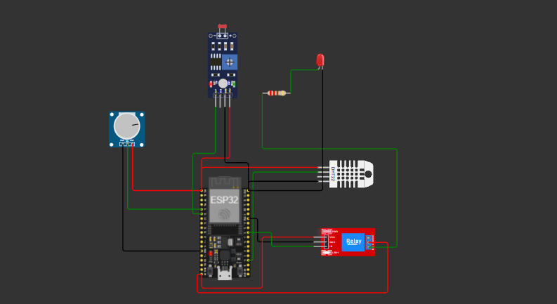
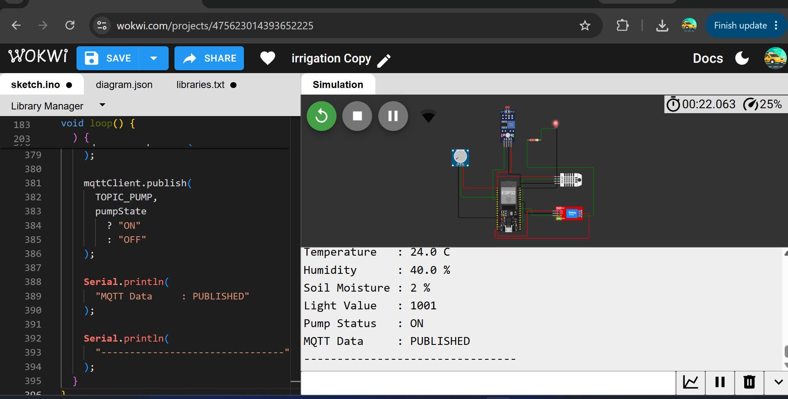
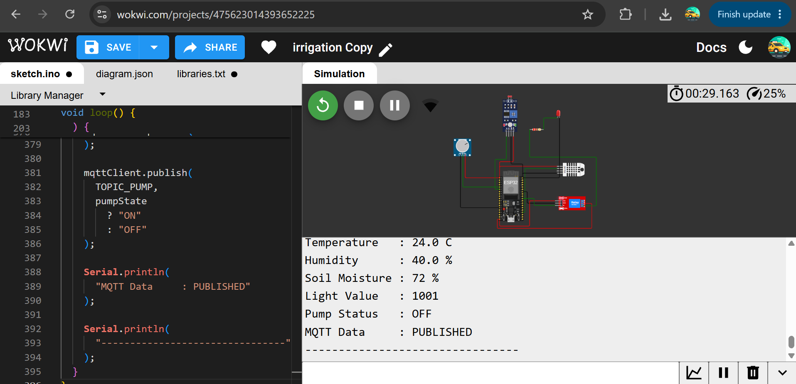
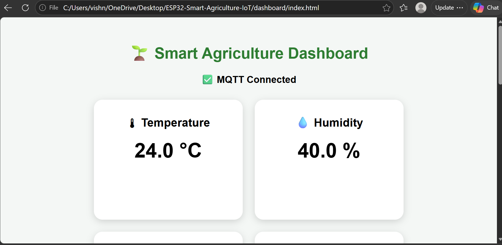
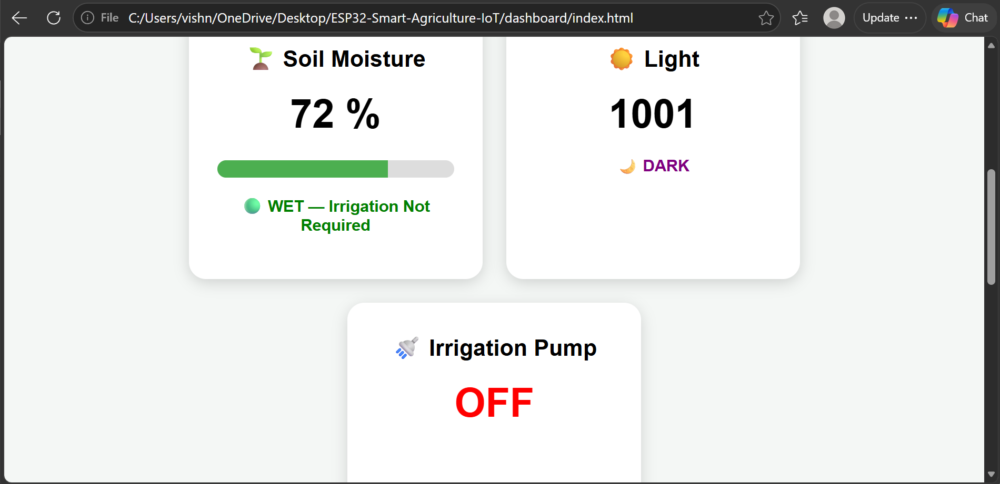
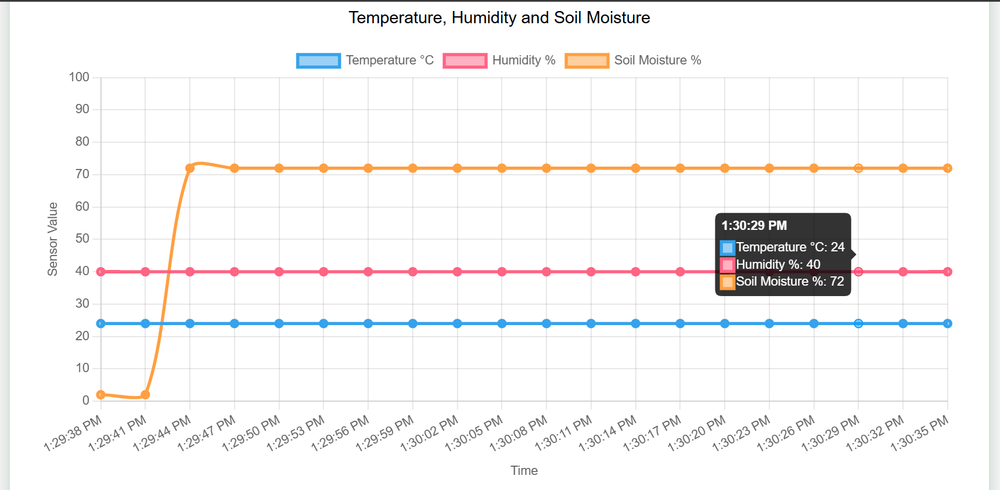

# ESP32 Smart Agriculture IoT System

## Overview

This project is an ESP32-based smart agriculture monitoring and automation system developed to monitor environmental conditions and soil moisture in real time.

The system collects data from multiple sensors and automatically controls irrigation based on the soil moisture level. A web dashboard is also used to display live sensor readings and visualize the collected data.

The complete system was developed and tested using Wokwi simulation.

## Features

- Real-time temperature monitoring
- Humidity monitoring
- Soil moisture monitoring
- Light intensity monitoring
- Automatic irrigation control
- Relay-based pump control
- Real-time serial monitoring
- IoT dashboard for live data display
- Graphical visualization of sensor readings
- Automated response based on soil moisture thresholds

## System Logic

The irrigation system operates automatically according to the detected soil moisture level.

- Pump turns ON when soil moisture is less than or equal to 35%
- Pump turns OFF when soil moisture reaches or exceeds 55%
- Between these values, the previous pump state is maintained

This control method helps prevent rapid switching of the irrigation system.

## Hardware / Components

- ESP32 DevKit V1
- DHT22 temperature and humidity sensor
- Soil moisture sensor
- Light sensor
- Relay module
- LED used to simulate the water pump
- Resistors and connecting wires

## Pin Configuration

| Component | ESP32 Pin |
|---|---|
| DHT22 | GPIO 15 |
| Soil Moisture Sensor | GPIO 34 |
| Light Sensor | GPIO 35 |
| Relay | GPIO 5 |

## Dashboard

A browser-based dashboard was developed to display the sensor information received from the ESP32.

The dashboard displays:

- Temperature
- Humidity
- Soil moisture
- Light intensity
- Irrigation status
- Live sensor data graphs

## Technologies Used

- ESP32
- Arduino / C++
- Wokwi
- HTML
- CSS
- JavaScript
- MQTT
- Chart.js

## Project Structure

```text
ESP32-Smart-Agriculture-IoT/
│
├── firmware/
│   └── sketch.ino
│
├── dashboard/
│   └── index.html
│
├── wokwi/
│   └── diagram.json
│
├── screenshots/
│
└── README.md
```
## Screenshots

### Circuit Diagram



The complete ESP32 Smart Agriculture IoT circuit developed and simulated in Wokwi.

### System Running



The system operating with real-time sensor readings and irrigation control.

### Moisture Threshold Response



System response when the soil moisture reaches the configured irrigation threshold.

### Dashboard Overview



Overview of the IoT dashboard displaying real-time agricultural monitoring data.

### Dashboard Monitoring



Live monitoring of sensor values and irrigation system status.

### Sensor Data Graphs



Graphical visualization of the sensor data collected by the system.95
